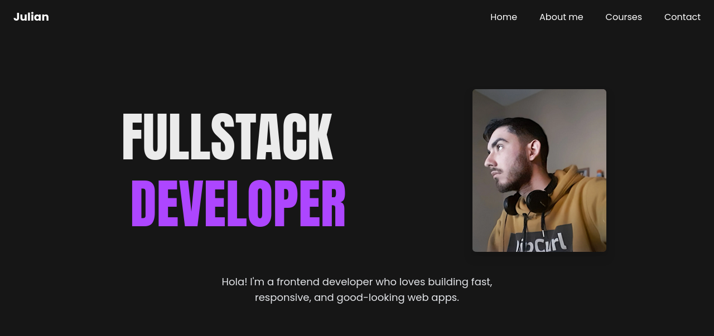

# 🌐 Portafolio Personal

Este es un portafolio web personal desarrollado para mostrar mis proyectos, habilidades y experiencia profesional. Es un sitio responsivo, moderno y optimizado para todos los dispositivos.

## 📸 Vista previa



---

## ✨ Características

- Diseño 100% responsive
- Secciones de proyectos, habilidades, experiencia y contacto
- Animaciones y transiciones suaves
- Fácil de actualizar

---

## 🚀 Tecnologías utilizadas

- React
- Vite
- Librerias:
  - Tailwind
  - Framer Motion
  - React-Scroller
  - EmailJs

---

## ⚙️ Cómo usarlo localmente

1. Clona el repositorio:

   ```bash
   git clone https://github.com/tu-usuario/tu-portafolio.git
   cd tu-portafolio
   ```

   2. Instala las dependencias:

   ```bash
   npm install
   ```

   3. Inicia el servidor:

   ```
    npm run dev
   ```
